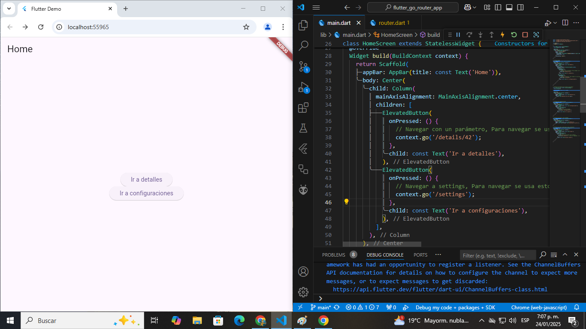

# 🚀 Flutter GoRouter Exercise

[](https://flutter.dev)

[](LICENSE)



## 📚 Descripción

Este es un proyecto creado para aprender y experimentar con la navegación en Flutter utilizando el paquete **GoRouter**, incluyendo rutas anidadas y protegidas.

## 🎯 Objetivo del Proyecto

- Comprender cómo funciona la navegación con el paquete **GoRouter** en Flutter.
- Explorar el manejo de rutas dinámicas con parámetros.
- Implementar rutas protegidas y anidadas.

## 🛠️ Características

- **Navegación Simple**: Rutas básicas utilizando `GoRouter`.
- **Rutas con Parámetros**: Manejo de rutas dinámicas con parámetros como el ID en la pantalla de detalles.
- **Rutas Anidadas**: Implementación de rutas dentro de rutas, como la pantalla de perfil dentro de configuraciones.
- **Rutas Protegidas**: Simulación de rutas protegidas con autenticación, como la ruta de perfil solo accesible para usuarios autenticados.

## 📂 Estructura del Proyecto

```plaintext
lib/
├── routing/            # Configuración de las rutas de navegación (GoRouter)
├── main.dart           # Punto de entrada de la app
```

## 🚀 Cómo Ejecutar el Proyecto

1. Asegúrate de tener Flutter instalado en tu sistema. Si no, sigue las instrucciones en la [documentación oficial](https://flutter.dev/)

2. Clona este repositorio:

```bash
git clone https://github.com/BastianNaitsab/flutter_go_router_exercise
```

3. Navega al directorio:

```bash
cd flutter_go_router_exercise
```

4. Instala las dependencias:

```bash
flutter pub get
```

5. Ejecuta la aplicación:

```bash
flutter run
```

## 🧰 Herramientas Usadas

- **Flutter SDK:** Framework
- **Dart:** Lenguaje de Programacion
- **VS Code:** Entorno de Desarrollo
- **GoRouter**: Paquete para gestionar rutas en Flutter

## 📖 Lo que He Aprendido

- 🌟 Aprendí a utilizar el paquete GoRouter para manejar la navegación de manera eficiente.
- 🌟 Experimenté con rutas dinámicas y cómo pasar parámetros a través de las URL.
- 🌟 Implementé rutas protegidas simulando un sistema de autenticación básica.
- 🌟 Descubrí cómo manejar rutas anidadas y estructurar aplicaciones con pantallas que contienen subpantallas.

## 📋 Próximos Pasos

- Mejorar la interfaz de usuario con animaciones y transiciones.

## 🤝 Contribuciones

Este proyecto es principalmente para aprendizaje personal, pero siéntete libre de proponer mejoras o sugerencias.

## 📞 Contacto
Bastian Naitsab - [devmentesacontacto@gmail.com](mailto:devmentesacontacto@gmail.com)  
GitHub: [BastianNaitsab](https://github.com/BastianNaitsab)